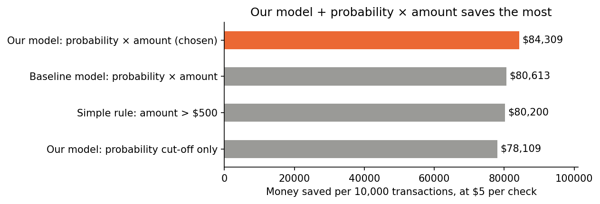

# Business impact — the alert policy (pitch material)

All numbers from repeated-CV **out-of-fold** predictions (honest simulation of unseen
transactions; the test set is never touched). Model: the shipped **LR + LightGBM blend**
(`docs/model_comparison_results.md`); baseline shown for comparison. Reproduced in
`notebooks/submission.ipynb` §7b. Assumptions: a missed fraud costs its full amount;
every alert costs **$5** of analyst time + customer friction (sensitivity $2/$15 in the
notebook).

## The three pitch sentences

1. **"Every alert is priced."** We alert when *expected loss* — P(fraud) × amount —
   exceeds the $5 review cost. On held-out data the final blend flags **17.3%** of
   transactions, catches **91.9% of fraud dollars** (55.2% of cases), and saves
   **$83,960 per 10,000 transactions** versus doing nothing.
2. **"The policy and the model both pay."** The dumb rule "flag everything over $500"
   saves $80,200/10k; the baseline model with the same priced-alert policy saves
   $80,613; the final blend with the priced-alert policy saves **$83,960** — and a
   plain probability cutoff on the same blend only $77,632. Both layers matter, and
   the policy is **harder to game** than an amount rule: splitting one big fraud into
   many small transactions drives the velocity features up and multiplies the
   fraudster's exposure (though no static rule is immune to a patient adversary).
3. **"The probabilities are honest, so the pricing is real."** OOF Brier 0.01515 vs
   0.01734 naive, and the worst probability-decile miscalibration is **0.27pp** — when
   the model says 30%, reality is ~30%. That's what makes p × amount an actual expected
   loss, and it's this track's stated judging focus.

## Key chart

| model | policy | % flagged | fraud cases | fraud $ | saved / 10k txns |
|---|---|---|---|---|---|
| — | no model | 0% | 0% | 0% | $0 |
| — | rule: amount > $500 | 10.6% | 34.3% | 84.9% | $80,200 |
| baseline LGBM | p-threshold optimum | 26.2% | 62.9% | 86.8% | $74,396 |
| baseline LGBM | p × amount > $5 | 14.3% | 51.6% | 87.1% | $80,613 |
| final blend | p-threshold optimum | 28.0% | 69.1% | 91.0% | $77,632 |
| **final blend** | **p × amount > $5** | **17.3%** | **55.2%** | **91.9%** | **$83,960** |

Capacity view (ranked by expected loss): top 1% of transactions ≈ 100 alerts/10k —
see §7b table for the blend's catch rates; sensitivity: $91,761/10k at $2 review cost,
$71,048/10k at $15.

Calibration note (for any future model swap): if a candidate uses class weights or
resampling, recalibrate on OOF before feeding this section — p × amount misprices every
alert otherwise. The shipped blend needs no recalibration (no weights; reliability
curve ≈ diagonal; isotonic made Brier worse in the 5×5 runs).
