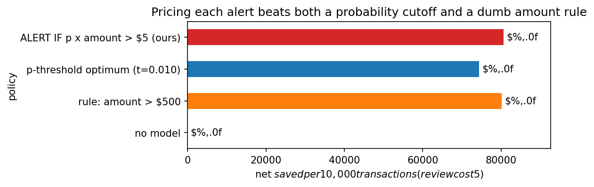

# Business impact — the alert policy (pitch material)

All numbers from repeated-CV **out-of-fold** predictions of the baseline LightGBM
(an honest simulation of unseen transactions; the test set is never touched).
Reproduced in `notebooks/submission.ipynb` §7b. Assumptions: a missed fraud costs its
full amount; every alert costs **$5** of analyst time + customer friction (sensitivity
$2/$15 shown in the notebook).

## The three pitch sentences

1. **"Every alert is priced."** We alert when *expected loss* — P(fraud) × amount —
   exceeds the $5 review cost. On held-out data that flags **14.3%** of transactions,
   catches **87.1% of fraud dollars** (51.6% of cases), and saves **$80,613 per 10,000
   transactions** versus doing nothing.
2. **"Smarter than both obvious alternatives."** The dumb rule "flag everything over
   $500" is gameable (split one big fraud into small ones) and treats a $501 grocery
   run like $5k of luxury goods from a brand-new device; the best pure probability
   cutoff wastes reviews on small-dollar fraud and saves **$6,200/10k less**. Our
   priced-alert rule beats both — and it only works because the model outputs
   **calibrated probabilities**, exactly what this track demands.
3. **"It fits any review team."** If capacity is just the top 1% of transactions
   (100 alerts per 10k), ranking by expected loss still intercepts **40.4% of fraud
   dollars**; top 5% intercepts **67.6%**.

## Key chart

| policy | % flagged | fraud cases | fraud $ | saved / 10k txns |
|---|---|---|---|---|
| no model | 0% | 0% | 0% | $0 |
| rule: amount > $500 | 10.6% | 34.3% | 84.9% | $80,200 |
| best probability cutoff (t=0.010) | 26.2% | 62.9% | 86.8% | $74,396 |
| **alert if p × amount > $5 (ours)** | **14.3%** | **51.6%** | **87.1%** | **$80,613** |

Honest footnote for Q&A: at $5 review cost the margin over the $500 rule is modest
($413/10k) — the real advantages are robustness to gaming, 1.5× more *cases* caught,
and that the margin grows as reviews get cheaper ($89,526/10k at $2). Swap in
Germaine's final model and these numbers update by re-running §7b.
